# Core Components

<cite>
**Referenced Files in This Document**
- [football_analysis.py](file://football_analysis.py)
- [football_analysis_stdlib.py](file://football_analysis_stdlib.py)
- [predict_match.py](file://predict_match.py)
</cite>

## Table of Contents
1. [Introduction](#introduction)
2. [Project Structure](#project-structure)
3. [Core Components](#core-components)
4. [Architecture Overview](#architecture-overview)
5. [Detailed Component Analysis](#detailed-component-analysis)
6. [Dependency Analysis](#dependency-analysis)
7. [Performance Considerations](#performance-considerations)
8. [Troubleshooting Guide](#troubleshooting-guide)
9. [Conclusion](#conclusion)

## Introduction
This document explains the core components of a football match prediction system with three implementation variants:
- Advanced FootballAnalyzer with machine learning (scikit-learn)
- Lightweight FootballAnalyzer_stdlib with pure Python and basic ML
- Interactive predict_match CLI for manual predictions and real-time team selection

It documents the data structure management system (FootballDataStructure), the statistical analysis engine, the machine learning prediction models, and the interactive interface. It also covers component relationships, data flow, and integration patterns.

## Project Structure
The project consists of three primary modules:
- Advanced analysis module: [football_analysis.py](file://football_analysis.py)
- Lightweight analysis module: [football_analysis_stdlib.py](file://football_analysis_stdlib.py)
- Interactive CLI: [predict_match.py](file://predict_match.py)

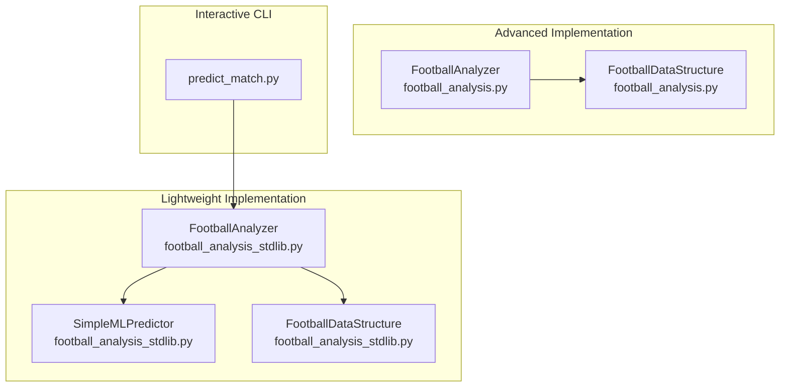

**Diagram sources**
- [football_analysis.py:84-108](file://football_analysis.py#L84-L108)
- [football_analysis_stdlib.py:183-191](file://football_analysis_stdlib.py#L183-L191)
- [predict_match.py:9-15](file://predict_match.py#L9-L15)

**Section sources**
- [football_analysis.py:1-12](file://football_analysis.py#L1-L12)
- [football_analysis_stdlib.py:1-12](file://football_analysis_stdlib.py#L1-L12)
- [predict_match.py:1-8](file://predict_match.py#L1-L8)

## Core Components
This section introduces the main building blocks and their responsibilities.

- FootballDataStructure: A custom dictionary-based data structure for efficient storage and updates of team statistics, head-to-head records, and competition counts. It supports incremental updates during dataset ingestion and provides aggregated metrics for analysis and modeling.
- Statistical Analysis Engine: Comprehensive analysis of team performance, goal patterns, match outcomes, and home advantage. It computes derived metrics such as win rates, goal differences, and competition averages.
- Machine Learning Prediction Models: Scikit-learn-based models (Random Forest, Gradient Boosting, Logistic Regression) trained on engineered features. The advanced analyzer selects the best-performing model and exposes prediction APIs.
- Lightweight SimpleMLPredictor: A pure-Python predictor that computes team strength, applies home advantage and head-to-head factors, and estimates outcome probabilities and expected goals without external ML libraries.
- Interactive CLI: A command-line interface enabling manual predictions, real-time team selection, and iterative prediction sessions.

**Section sources**
- [football_analysis.py:20-82](file://football_analysis.py#L20-L82)
- [football_analysis.py:84-628](file://football_analysis.py#L84-L628)
- [football_analysis_stdlib.py:13-80](file://football_analysis_stdlib.py#L13-L80)
- [football_analysis_stdlib.py:82-181](file://football_analysis_stdlib.py#L82-L181)
- [predict_match.py:9-57](file://predict_match.py#L9-L57)

## Architecture Overview
The system separates concerns into data ingestion, data structure management, analytics, and prediction layers. The advanced analyzer integrates scikit-learn for robust ML training and inference, while the lightweight analyzer implements a custom predictor for portability and simplicity.

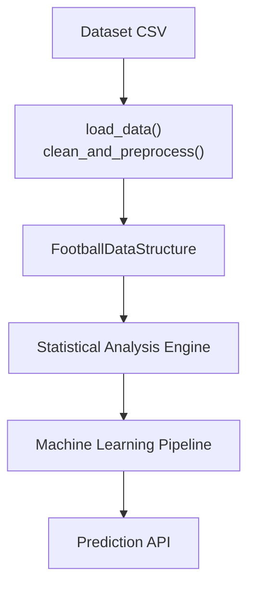

**Diagram sources**
- [football_analysis.py:96-142](file://football_analysis.py#L96-L142)
- [football_analysis.py:144-187](file://football_analysis.py#L144-L187)
- [football_analysis.py:348-477](file://football_analysis.py#L348-L477)

## Detailed Component Analysis

### Advanced FootballAnalyzer (football_analysis.py)
The advanced analyzer orchestrates loading, preprocessing, data structure building, statistical analysis, ML training, and prediction.

Key responsibilities:
- Load and preprocess CSV data, derive outcome encodings, and compute derived metrics.
- Build custom data structures for team stats, head-to-head, and competitions.
- Compute team statistics, goal patterns, match outcomes, and home advantage.
- Engineer features, train multiple ML models, select the best model, and expose prediction APIs.
- Generate comprehensive reports summarizing findings.

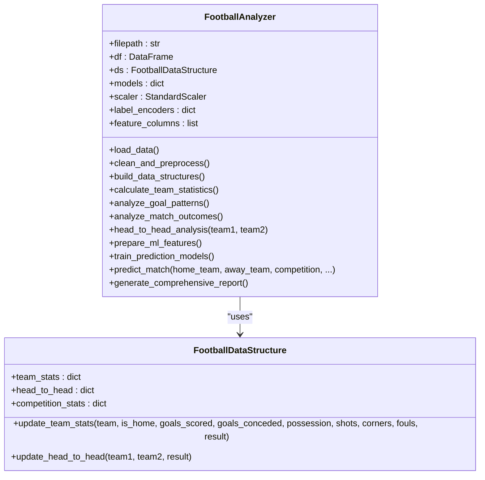

**Diagram sources**
- [football_analysis.py:20-82](file://football_analysis.py#L20-L82)
- [football_analysis.py:84-628](file://football_analysis.py#L84-L628)

**Section sources**
- [football_analysis.py:84-108](file://football_analysis.py#L84-L108)
- [football_analysis.py:110-142](file://football_analysis.py#L110-L142)
- [football_analysis.py:144-187](file://football_analysis.py#L144-L187)
- [football_analysis.py:189-235](file://football_analysis.py#L189-L235)
- [football_analysis.py:237-279](file://football_analysis.py#L237-L279)
- [football_analysis.py:281-316](file://football_analysis.py#L281-L316)
- [football_analysis.py:318-347](file://football_analysis.py#L318-L347)
- [football_analysis.py:348-413](file://football_analysis.py#L348-L413)
- [football_analysis.py:415-477](file://football_analysis.py#L415-L477)
- [football_analysis.py:479-560](file://football_analysis.py#L479-L560)
- [football_analysis.py:562-628](file://football_analysis.py#L562-L628)

### Lightweight FootballAnalyzer (football_analysis_stdlib.py)
The lightweight analyzer provides a pure-Python implementation with a custom predictor and minimal dependencies.

Key responsibilities:
- Load CSV data using the standard library.
- Build custom data structures and compute derived statistics.
- Display team rankings, goal statistics, outcomes, head-to-head, and competition analysis.
- Run predictions using a custom weighted predictor and support custom match predictions.

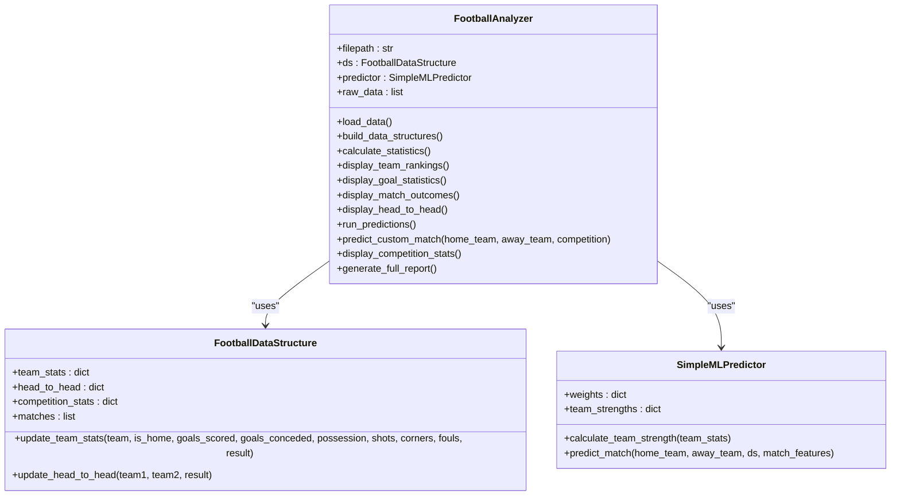

**Diagram sources**
- [football_analysis_stdlib.py:13-80](file://football_analysis_stdlib.py#L13-L80)
- [football_analysis_stdlib.py:82-181](file://football_analysis_stdlib.py#L82-L181)
- [football_analysis_stdlib.py:183-526](file://football_analysis_stdlib.py#L183-L526)

**Section sources**
- [football_analysis_stdlib.py:183-204](file://football_analysis_stdlib.py#L183-L204)
- [football_analysis_stdlib.py:206-261](file://football_analysis_stdlib.py#L206-L261)
- [football_analysis_stdlib.py:262-313](file://football_analysis_stdlib.py#L262-L313)
- [football_analysis_stdlib.py:315-370](file://football_analysis_stdlib.py#L315-L370)
- [football_analysis_stdlib.py:371-397](file://football_analysis_stdlib.py#L371-L397)
- [football_analysis_stdlib.py:398-421](file://football_analysis_stdlib.py#L398-L421)
- [football_analysis_stdlib.py:422-477](file://football_analysis_stdlib.py#L422-L477)
- [football_analysis_stdlib.py:479-526](file://football_analysis_stdlib.py#L479-L526)

### Interactive predict_match CLI (predict_match.py)
The CLI enables interactive predictions by loading data, displaying available teams, and prompting for user input to predict outcomes.

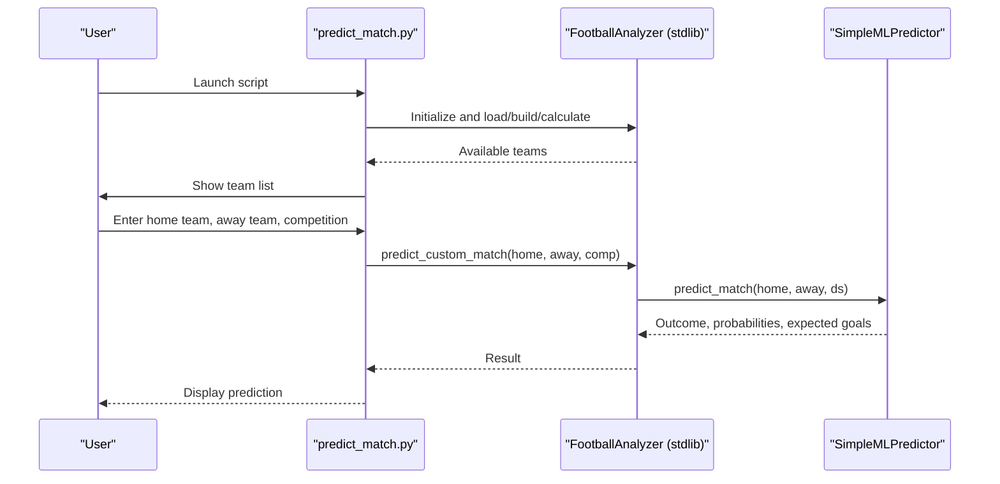

**Diagram sources**
- [predict_match.py:9-57](file://predict_match.py#L9-L57)
- [football_analysis_stdlib.py:457-477](file://football_analysis_stdlib.py#L457-L477)

**Section sources**
- [predict_match.py:9-57](file://predict_match.py#L9-L57)
- [football_analysis_stdlib.py:457-477](file://football_analysis_stdlib.py#L457-L477)

### Data Structure Management System
Both analyzers rely on a custom dictionary-based data structure to manage:
- Team statistics: matches played, wins/draws/losses, goals scored/conceded, home/away performance, possession, shots, corners, fouls.
- Head-to-head records: win/draw/loss counts for pairings.
- Competition analysis: counts per competition.

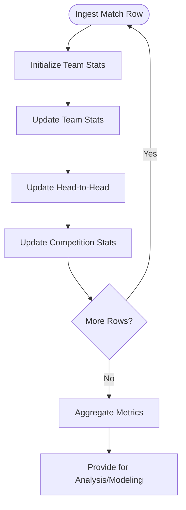

**Diagram sources**
- [football_analysis.py:43-81](file://football_analysis.py#L43-L81)
- [football_analysis_stdlib.py:39-79](file://football_analysis_stdlib.py#L39-L79)

**Section sources**
- [football_analysis.py:20-82](file://football_analysis.py#L20-L82)
- [football_analysis_stdlib.py:13-80](file://football_analysis_stdlib.py#L13-L80)

### Statistical Analysis Engine
The statistical engine performs:
- Team performance metrics: win/draw/loss rates, goal difference, average goals, home/away win rates, points.
- Goal pattern recognition: total goals, average goals, goal distribution, clean sheets, high-scoring matches.
- Match outcome analysis: outcome distribution, home advantage ratio, competition-wise outcomes.
- Head-to-head analysis: specific matchups and top rivalries.

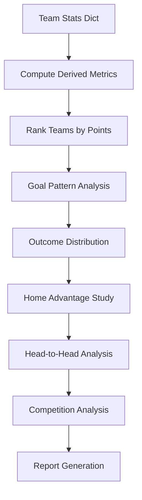

**Diagram sources**
- [football_analysis.py:189-235](file://football_analysis.py#L189-L235)
- [football_analysis.py:237-279](file://football_analysis.py#L237-L279)
- [football_analysis.py:281-316](file://football_analysis.py#L281-L316)
- [football_analysis.py:318-347](file://football_analysis.py#L318-L347)
- [football_analysis.py:611-616](file://football_analysis.py#L611-L616)

**Section sources**
- [football_analysis.py:189-235](file://football_analysis.py#L189-L235)
- [football_analysis.py:237-279](file://football_analysis.py#L237-L279)
- [football_analysis.py:281-316](file://football_analysis.py#L281-L316)
- [football_analysis.py:318-347](file://football_analysis.py#L318-L347)
- [football_analysis.py:611-616](file://football_analysis.py#L611-L616)

### Machine Learning Prediction Models
The advanced analyzer trains and evaluates:
- Random Forest
- Gradient Boosting
- Logistic Regression

Feature engineering includes encoded categorical variables, team strength, and historical head-to-head win rate. The best model is selected by accuracy and used for predictions.

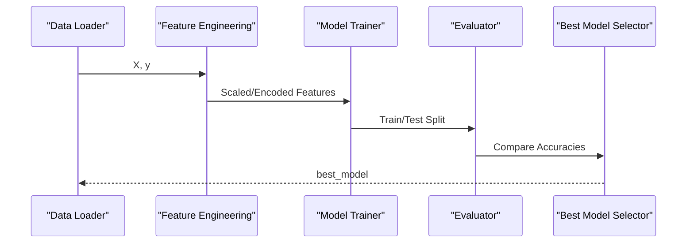

**Diagram sources**
- [football_analysis.py:348-413](file://football_analysis.py#L348-L413)
- [football_analysis.py:415-477](file://football_analysis.py#L415-L477)

**Section sources**
- [football_analysis.py:348-413](file://football_analysis.py#L348-L413)
- [football_analysis.py:415-477](file://football_analysis.py#L415-L477)

### Lightweight SimpleMLPredictor
The lightweight predictor computes:
- Team strength from win rate, goal difference, and average goals.
- Home advantage and head-to-head factors.
- Outcome probabilities and expected goals with defensive adjustments.

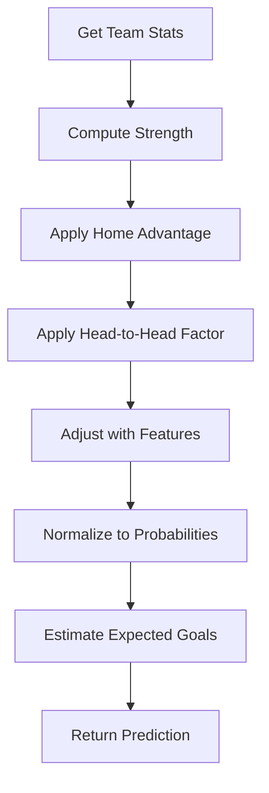

**Diagram sources**
- [football_analysis_stdlib.py:89-106](file://football_analysis_stdlib.py#L89-L106)
- [football_analysis_stdlib.py:108-180](file://football_analysis_stdlib.py#L108-L180)

**Section sources**
- [football_analysis_stdlib.py:82-181](file://football_analysis_stdlib.py#L82-L181)

### Interactive CLI Interface
The CLI loads data, displays available teams, and allows interactive predictions with real-time team selection.

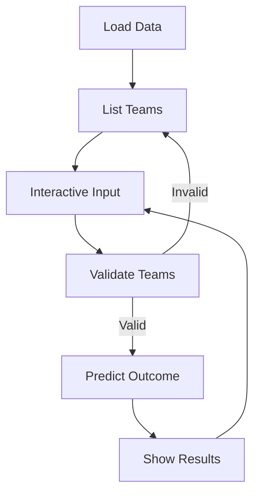

**Diagram sources**
- [predict_match.py:9-57](file://predict_match.py#L9-L57)

**Section sources**
- [predict_match.py:9-57](file://predict_match.py#L9-L57)

## Dependency Analysis
- Advanced analyzer depends on pandas, numpy, scikit-learn for data manipulation, preprocessing, and ML training.
- Lightweight analyzer depends on standard library modules (csv, json, collections, datetime, math, random) plus numpy for numerical computations.
- Interactive CLI imports the lightweight analyzer and predictor to provide a user-friendly interface.

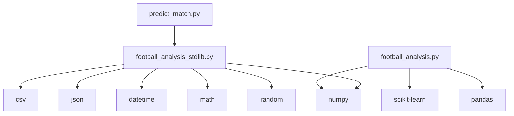

**Diagram sources**
- [football_analysis.py:6-18](file://football_analysis.py#L6-L18)
- [football_analysis_stdlib.py:6-11](file://football_analysis_stdlib.py#L6-L11)
- [predict_match.py:6-7](file://predict_match.py#L6-L7)

**Section sources**
- [football_analysis.py:6-18](file://football_analysis.py#L6-L18)
- [football_analysis_stdlib.py:6-11](file://football_analysis_stdlib.py#L6-L11)
- [predict_match.py:6-7](file://predict_match.py#L6-L7)

## Performance Considerations
- Data ingestion and preprocessing: Prefer vectorized operations (pandas) for speed; lightweight analyzer uses iteration over CSV rows.
- Feature scaling: Scaling is essential for Logistic Regression; the advanced analyzer scales features before training.
- Model training: Tree-based models (Random Forest, Gradient Boosting) are robust and fast; Logistic Regression benefits from scaled features.
- Memory usage: Custom dictionaries minimize overhead compared to heavy frameworks; consider chunking for very large datasets.
- Prediction latency: Lightweight predictor avoids external ML dependencies, reducing startup time and memory footprint.

## Troubleshooting Guide
Common issues and resolutions:
- Missing dataset path: Ensure the CSV path is correct and accessible.
- Encoding errors: Verify CSV encoding and handle special characters appropriately.
- Feature mismatch: When adding new features, ensure they align with training and prediction pipelines.
- Team not found: Validate team names against the dataset; normalization may be required.
- Model convergence: Increase iterations or adjust regularization for Logistic Regression.

**Section sources**
- [football_analysis.py:96-108](file://football_analysis.py#L96-L108)
- [football_analysis_stdlib.py:192-204](file://football_analysis_stdlib.py#L192-L204)
- [predict_match.py:44-49](file://predict_match.py#L44-L49)

## Conclusion
The system provides two complementary implementations:
- Advanced FootballAnalyzer for production-grade ML predictions with robust feature engineering and model evaluation.
- Lightweight FootballAnalyzer for educational and portable deployments using pure Python and a custom predictor.
- Interactive CLI for hands-on prediction sessions.

The modular design ensures clear separation of concerns, efficient data structures, and extensible analytics and modeling capabilities.