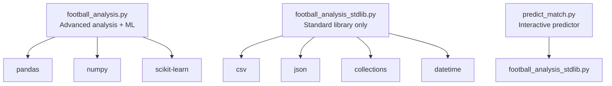

# Getting Started

<cite>
**Referenced Files in This Document**
- [football_analysis.py](file://football_analysis.py)
- [football_analysis_stdlib.py](file://football_analysis_stdlib.py)
- [predict_match.py](file://predict_match.py)
</cite>

## Table of Contents
1. [Introduction](#introduction)
2. [Project Structure](#project-structure)
3. [System Requirements](#system-requirements)
4. [Installation](#installation)
5. [Dataset Preparation](#dataset-preparation)
6. [Running the Components](#running-the-components)
7. [Basic Usage Examples](#basic-usage-examples)
8. [Troubleshooting](#troubleshooting)
9. [Conclusion](#conclusion)

## Introduction
This guide helps you set up and use the football match predictor system. It includes two analysis modes:
- Advanced analysis with machine learning (requires external libraries)
- Lightweight analysis using only Python standard library

You will learn how to install prerequisites, prepare a CSV dataset, and run each component to analyze historical data and predict match outcomes.

## Project Structure
The project consists of three main scripts:
- Automated analysis with machine learning: [football_analysis.py](file://football_analysis.py)
- Lightweight analysis using only standard library: [football_analysis_stdlib.py](file://football_analysis_stdlib.py)
- Interactive prediction interface: [predict_match.py](file://predict_match.py)

**Diagram sources**
- [football_analysis.py:6-18](file://football_analysis.py#L6-L18)
- [football_analysis_stdlib.py:6-12](file://football_analysis_stdlib.py#L6-L12)
- [predict_match.py:7](file://predict_match.py#L7)

**Section sources**
- [football_analysis.py:1-673](file://football_analysis.py#L1-L673)
- [football_analysis_stdlib.py:1-547](file://football_analysis_stdlib.py#L1-L547)
- [predict_match.py:1-58](file://predict_match.py#L1-L58)

## System Requirements
- Python 3.7 or higher
- For advanced analysis (machine learning):
  - pandas
  - numpy
  - scikit-learn
- For lightweight analysis (standard library only):
  - Python standard library modules only (no extra packages)

**Section sources**
- [football_analysis.py:6-18](file://football_analysis.py#L6-L18)
- [football_analysis_stdlib.py:6-12](file://football_analysis_stdlib.py#L6-L12)

## Installation
Follow these steps to install and configure your environment.

### Install Python
- Download and install Python 3.7 or later from [python.org](https://www.python.org/downloads/).
- Verify installation: open a terminal or command prompt and run:
  - python --version
  - pip --version

### Install Dependencies (Advanced Analysis Only)
If you want to use the advanced analysis with machine learning, install the following packages:
- pandas
- numpy
- scikit-learn

Install using pip:
- pip install pandas numpy scikit-learn

Verify installation:
- python -c "import pandas, numpy, sklearn; print('All packages installed successfully')"

Notes:
- The lightweight script does not require these packages.
- If you encounter permission errors, use your system’s package manager or consult your IT department.

**Section sources**
- [football_analysis.py:6-18](file://football_analysis.py#L6-L18)

## Dataset Preparation
The system expects a CSV dataset with the following columns:
- Date
- Home Team
- Away Team
- Winner
- Home Goals
- Away Goals
- Possession % (Home)
- Shots (Home)
- Corners (Home)
- Fouls (Home)
- Possession % (Away)
- Shots (Away)
- Corners (Away)
- Fouls (Away)
- Competition

### Dataset Location
By default, the scripts expect the dataset at:
- D:\prject dsa\Football_Dataset_2015_2025.csv

If your dataset is elsewhere, edit the file path in the main functions of each script:
- [football_analysis.py:633](file://football_analysis.py#L633)
- [football_analysis_stdlib.py:531](file://football_analysis_stdlib.py#L531)
- [predict_match.py:12](file://predict_match.py#L12)

### Data Validation Tips
- Ensure all required columns are present and spelled exactly as listed.
- Confirm numeric columns (goals, possession, shots, corners, fouls) contain valid numbers.
- Verify dates are readable by the system (ISO-like formats work best).

**Section sources**
- [football_analysis.py:102-108](file://football_analysis.py#L102-L108)
- [football_analysis_stdlib.py:199-204](file://football_analysis_stdlib.py#L199-L204)
- [football_analysis.py:633](file://football_analysis.py#L633)
- [football_analysis_stdlib.py:531](file://football_analysis_stdlib.py#L531)
- [predict_match.py:12](file://predict_match.py#L12)

## Running the Components

### Automated Analysis with Machine Learning (Advanced)
Purpose: Load data, clean and preprocess, build data structures, compute statistics, analyze patterns, train prediction models, and generate a comprehensive report.

Command:
- python football_analysis.py

What it does:
- Loads the dataset
- Cleans and preprocesses data
- Builds internal data structures
- Calculates team statistics
- Analyzes goal patterns and outcomes
- Trains multiple ML models
- Generates a detailed report
- Provides sample predictions

Expected output highlights:
- Dataset overview (counts, date range, competitions)
- Team rankings by points
- Goal statistics and distributions
- Outcome distributions (home win, away win, draw)
- Head-to-head insights
- Model performance metrics
- Sample predictions with probabilities and expected goals

**Section sources**
- [football_analysis.py:630-673](file://football_analysis.py#L630-L673)
- [football_analysis.py:96-142](file://football_analysis.py#L96-L142)
- [football_analysis.py:144-186](file://football_analysis.py#L144-L186)
- [football_analysis.py:189-235](file://football_analysis.py#L189-L235)
- [football_analysis.py:237-279](file://football_analysis.py#L237-L279)
- [football_analysis.py:281-316](file://football_analysis.py#L281-L316)
- [football_analysis.py:318-347](file://football_analysis.py#L318-L347)
- [football_analysis.py:415-477](file://football_analysis.py#L415-L477)
- [football_analysis.py:562-628](file://football_analysis.py#L562-L628)

### Lightweight Analysis (Standard Library Only)
Purpose: Load data, build data structures, compute statistics, and provide interactive predictions without external ML libraries.

Command:
- python football_analysis_stdlib.py

What it does:
- Loads the dataset from CSV
- Builds internal data structures
- Computes team statistics
- Displays team rankings, goal statistics, outcomes, head-to-head, and competition analysis
- Runs sample predictions
- Generates a full report

Expected output highlights:
- Team rankings by points
- Goal statistics and distributions
- Outcome distributions
- Head-to-head rivalry insights
- Competition analysis
- Sample predictions with probabilities and expected goals

**Section sources**
- [football_analysis_stdlib.py:528-547](file://football_analysis_stdlib.py#L528-L547)
- [football_analysis_stdlib.py:192-261](file://football_analysis_stdlib.py#L192-L261)
- [football_analysis_stdlib.py:262-314](file://football_analysis_stdlib.py#L262-L314)
- [football_analysis_stdlib.py:315-370](file://football_analysis_stdlib.py#L315-L370)
- [football_analysis_stdlib.py:371-397](file://football_analysis_stdlib.py#L371-L397)
- [football_analysis_stdlib.py:398-421](file://football_analysis_stdlib.py#L398-L421)
- [football_analysis_stdlib.py:479-500](file://football_analysis_stdlib.py#L479-L500)
- [football_analysis_stdlib.py:501-526](file://football_analysis_stdlib.py#L501-L526)

### Interactive Prediction
Purpose: Interactively predict outcomes for any two teams from your dataset.

Command:
- python predict_match.py

What it does:
- Loads data and builds structures
- Lists available teams
- Prompts for home team, away team, and competition
- Validates inputs
- Predicts outcome with probabilities and expected goals

Example interaction:
- Enter Home Team: Liverpool
- Enter Away Team: Manchester City
- Enter Competition: Premier League
- Output: Predicted winner, confidence, probabilities, expected goals

**Section sources**
- [predict_match.py:9-58](file://predict_match.py#L9-L58)
- [football_analysis_stdlib.py:457-477](file://football_analysis_stdlib.py#L457-L477)

## Basic Usage Examples

### Automated Analysis (Advanced)
- Command: python football_analysis.py
- Expected result: A comprehensive report printed to the console, including team rankings, goal statistics, outcome analysis, model performance, and sample predictions.

### Lightweight Analysis (Standard Library)
- Command: python football_analysis_stdlib.py
- Expected result: A detailed analysis printed to the console, including team rankings, goal statistics, outcomes, head-to-head, competition analysis, and sample predictions.

### Interactive Prediction
- Command: python predict_match.py
- Expected result: A prompt-driven interface where you enter team names and competition, then receive a prediction with probabilities and expected goals.

**Section sources**
- [football_analysis.py:630-673](file://football_analysis.py#L630-L673)
- [football_analysis_stdlib.py:528-547](file://football_analysis_stdlib.py#L528-L547)
- [predict_match.py:9-58](file://predict_match.py#L9-L58)

## Troubleshooting

### Python Not Found
- Symptom: Command not recognized
- Fix: Ensure Python is installed and added to PATH. Reopen your terminal or command prompt.

### Permission Denied Installing Packages
- Symptom: Permission errors when installing pandas/numpy/scikit-learn
- Fix: Use your system’s package manager or consult your administrator. Alternatively, install in a virtual environment.

### Missing Dependencies (Advanced Mode)
- Symptom: ImportError for pandas/numpy/sklearn
- Fix: Install the required packages using pip:
  - pip install pandas numpy scikit-learn
- Verify installation:
  - python -c "import pandas, numpy, sklearn"

### Dataset Path Issues
- Symptom: FileNotFoundError or empty dataset
- Fix: Edit the hardcoded path in the main function of each script to point to your CSV file:
  - [football_analysis.py:633](file://football_analysis.py#L633)
  - [football_analysis_stdlib.py:531](file://football_analysis_stdlib.py#L531)
  - [predict_match.py:12](file://predict_match.py#L12)

### Invalid Column Names
- Symptom: KeyError or parsing errors
- Fix: Ensure your CSV contains all required columns exactly as listed in the dataset preparation section.

### Unexpected Output or No Predictions
- Symptom: Predictions fail or produce unexpected results
- Fix: Confirm the dataset contains sufficient historical matches for the teams you are predicting. The system relies on historical patterns.

### Virtual Environment Setup (Optional)
- Create a virtual environment:
  - python -m venv predictor_env
  - predictor_env\Scripts\activate (Windows) or source predictor_env/bin/activate (Linux/macOS)
- Install dependencies inside the environment:
  - pip install pandas numpy scikit-learn

**Section sources**
- [football_analysis.py:633](file://football_analysis.py#L633)
- [football_analysis_stdlib.py:531](file://football_analysis_stdlib.py#L531)
- [predict_match.py:12](file://predict_match.py#L12)

## Conclusion
You now have everything needed to install the system, prepare your dataset, and run either the advanced machine learning analysis or the lightweight standard library analysis. Use the interactive predictor to explore custom match outcomes. If you encounter issues, refer to the troubleshooting section for quick fixes.