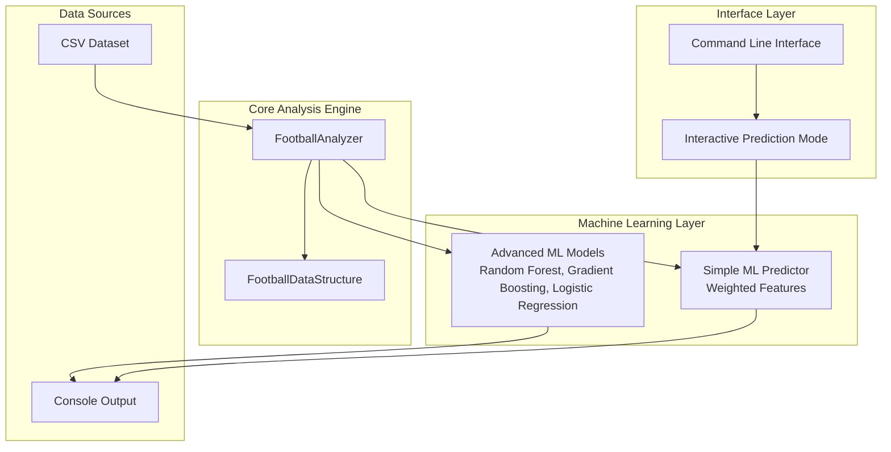
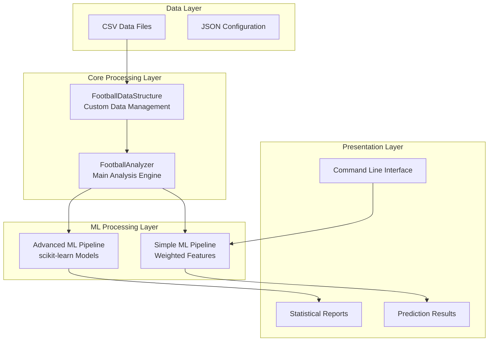
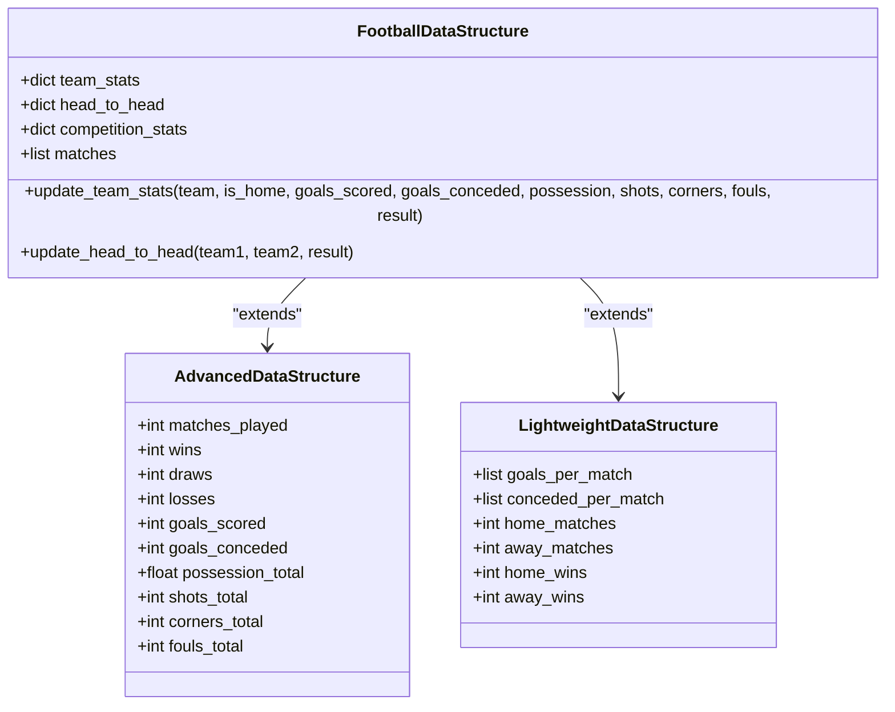
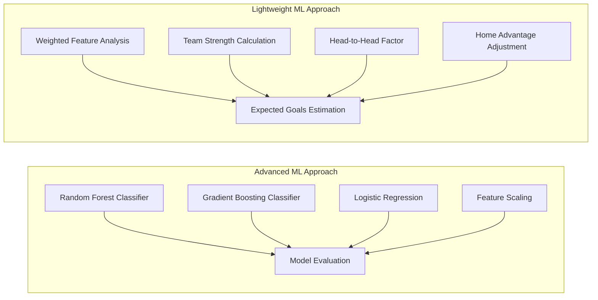
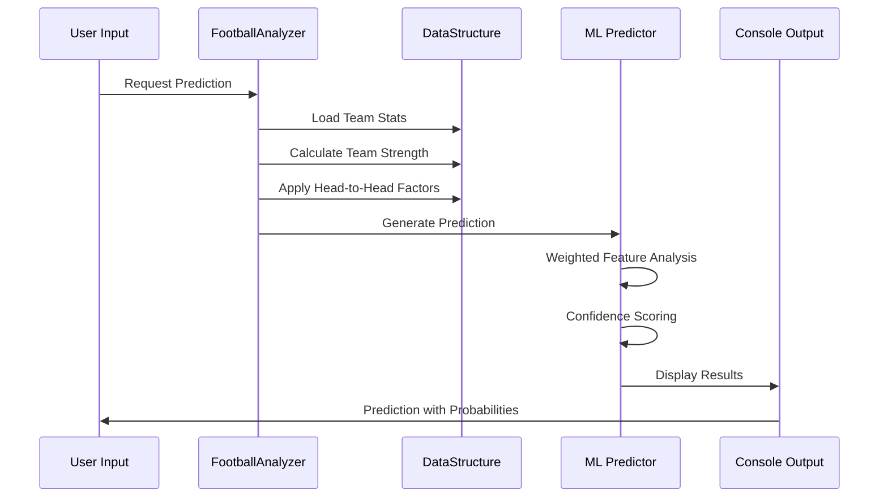
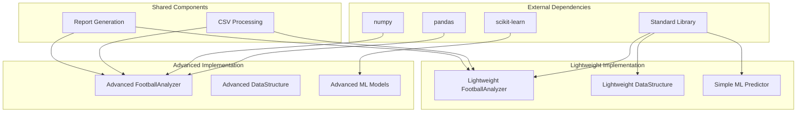

# Project Overview

<cite>
**Referenced Files in This Document**
- [football_analysis.py](file://football_analysis.py)
- [football_analysis_stdlib.py](file://football_analysis_stdlib.py)
- [predict_match.py](file://predict_match.py)
</cite>

## Table of Contents
1. [Introduction](#introduction)
2. [Project Structure](#project-structure)
3. [Core Components](#core-components)
4. [Architecture Overview](#architecture-overview)
5. [Detailed Component Analysis](#detailed-component-analysis)
6. [Dependency Analysis](#dependency-analysis)
7. [Performance Considerations](#performance-considerations)
8. [Troubleshooting Guide](#troubleshooting-guide)
9. [Conclusion](#conclusion)

## Introduction
This football match prediction system is designed to analyze historical football data and provide automated predictions for upcoming matches. The system serves sports analysts, professional bettors, and football enthusiasts who seek data-driven insights into team performance, statistical trends, and match outcomes.

The project combines two complementary implementation approaches:
- Advanced analysis system using scikit-learn for machine learning-powered predictions
- Lightweight alternative using only Python standard library for basic statistical analysis

Both variants share the same core data structures and analysis methodologies while differing in computational complexity and feature richness.

## Project Structure
The system consists of three main components organized in a modular architecture:

**Diagram sources**
- [football_analysis.py:20-95](file://football_analysis.py#L20-L95)
- [football_analysis_stdlib.py:13-189](file://football_analysis_stdlib.py#L13-L189)
- [predict_match.py:9-57](file://predict_match.py#L9-L57)

**Section sources**
- [football_analysis.py:1-673](file://football_analysis.py#L1-L673)
- [football_analysis_stdlib.py:1-547](file://football_analysis_stdlib.py#L1-L547)
- [predict_match.py:1-58](file://predict_match.py#L1-L58)

## Core Components
The system provides three distinct analysis modes, each serving different user needs and computational requirements:

### Advanced Analysis System (Scikit-learn Implementation)
The primary analysis engine utilizes sophisticated machine learning algorithms for predictive modeling:

**Key Capabilities:**
- Multi-model ensemble with Random Forest, Gradient Boosting, and Logistic Regression
- Comprehensive feature engineering including team strength metrics and head-to-head statistics
- Statistical analysis of goal patterns, match outcomes, and competitive trends
- Automated prediction workflows with confidence scoring
- Detailed performance reporting and model evaluation

**Target Audience:** Professional sports analysts, data scientists, and organizations requiring robust predictive analytics.

### Lightweight Alternative (Standard Library Implementation)
A simplified implementation designed for minimal dependencies and quick analysis:

**Key Capabilities:**
- Pure Python implementation using only standard library modules
- Weighted feature-based prediction algorithm
- Real-time interactive prediction interface
- Streamlined statistical analysis without external dependencies
- Fast startup and execution for resource-constrained environments

**Target Audience:** Casual users, educational purposes, and environments with restricted package installations.

### Interactive Prediction Interface
A command-line interface enabling real-time match predictions:

**Key Features:**
- Team selection from available dataset
- Interactive input prompts for match details
- Real-time prediction generation with confidence metrics
- Visual probability displays with progress bars
- Extensible framework for custom match analysis

**Target Audience:** End users seeking immediate predictions without programming knowledge.

**Section sources**
- [football_analysis.py:84-673](file://football_analysis.py#L84-L673)
- [football_analysis_stdlib.py:183-547](file://football_analysis_stdlib.py#L183-L547)
- [predict_match.py:9-58](file://predict_match.py#L9-L58)

## Architecture Overview
The system employs a layered architecture with clear separation of concerns:

**Diagram sources**
- [football_analysis.py:20-95](file://football_analysis.py#L20-L95)
- [football_analysis_stdlib.py:13-189](file://football_analysis_stdlib.py#L13-L189)
- [predict_match.py:9-57](file://predict_match.py#L9-L57)

The architecture supports both batch analysis workflows and real-time prediction scenarios, with each component maintaining clear responsibilities and minimal coupling.

## Detailed Component Analysis

### Data Structure Foundation
Both implementations utilize custom data structures for efficient football data management:

**Diagram sources**
- [football_analysis.py:20-82](file://football_analysis.py#L20-L82)
- [football_analysis_stdlib.py:13-80](file://football_analysis_stdlib.py#L13-L80)

**Section sources**
- [football_analysis.py:20-82](file://football_analysis.py#L20-L82)
- [football_analysis_stdlib.py:13-80](file://football_analysis_stdlib.py#L13-L80)

### Machine Learning Implementation Comparison

**Diagram sources**
- [football_analysis.py:415-477](file://football_analysis.py#L415-L477)
- [football_analysis_stdlib.py:82-180](file://football_analysis_stdlib.py#L82-L180)

The advanced approach provides comprehensive model evaluation with multiple algorithms and feature importance analysis, while the lightweight approach offers immediate predictions through weighted feature combinations.

### Prediction Workflow Analysis

**Diagram sources**
- [football_analysis.py:479-560](file://football_analysis.py#L479-L560)
- [football_analysis_stdlib.py:108-180](file://football_analysis_stdlib.py#L108-L180)

**Section sources**
- [football_analysis.py:479-560](file://football_analysis.py#L479-L560)
- [football_analysis_stdlib.py:108-180](file://football_analysis_stdlib.py#L108-L180)

## Dependency Analysis
The system maintains clear dependency boundaries between components:

**Diagram sources**
- [football_analysis.py:6-18](file://football_analysis.py#L6-L18)
- [football_analysis_stdlib.py:6-12](file://football_analysis_stdlib.py#L6-L12)

The dependency analysis reveals a clean separation where the advanced implementation relies on scientific computing libraries while the lightweight implementation remains self-contained.

**Section sources**
- [football_analysis.py:6-18](file://football_analysis.py#L6-L18)
- [football_analysis_stdlib.py:6-12](file://football_analysis_stdlib.py#L6-L12)

## Performance Considerations
The system provides two performance profiles optimized for different use cases:

### Advanced Implementation Performance
- **Training Time:** Several seconds to minutes depending on dataset size
- **Memory Usage:** Higher due to model storage and feature scaling
- **Prediction Latency:** Sub-millisecond for single predictions
- **Scalability:** Handles large datasets with optimized feature engineering

### Lightweight Implementation Performance
- **Startup Time:** Instant initialization with no external dependencies
- **Memory Usage:** Minimal footprint suitable for embedded systems
- **Prediction Latency:** Microsecond-level calculations
- **Scalability:** Limited by Python interpreter performance

**Section sources**
- [football_analysis.py:415-477](file://football_analysis.py#L415-L477)
- [football_analysis_stdlib.py:82-180](file://football_analysis_stdlib.py#L82-L180)

## Troubleshooting Guide

### Common Issues and Solutions

**Dataset Loading Problems:**
- Verify CSV file path exists and is accessible
- Check CSV format matches expected column structure
- Ensure proper encoding (UTF-8) for international team names

**Model Training Failures:**
- Confirm scikit-learn installation for advanced implementation
- Verify sufficient training data for reliable model performance
- Check for missing values in categorical variables

**Prediction Accuracy Concerns:**
- Validate team names match dataset exactly (case-sensitive)
- Ensure sufficient historical data for meaningful predictions
- Consider recent form adjustments for current season analysis

**Performance Issues:**
- For large datasets, consider memory constraints
- Lightweight implementation may lack advanced statistical features
- Network connectivity issues for external dependency downloads

**Section sources**
- [football_analysis.py:630-673](file://football_analysis.py#L630-L673)
- [football_analysis_stdlib.py:528-547](file://football_analysis_stdlib.py#L528-L547)

## Conclusion
This football match prediction system provides a comprehensive solution for football analysis and prediction needs. The dual implementation approach ensures accessibility across different technical requirements and computational environments.

The advanced implementation offers enterprise-grade predictive capabilities with sophisticated machine learning models, while the lightweight alternative delivers immediate insights without external dependencies. Together, they serve the diverse needs of the football analysis community, from casual enthusiasts to professional analysts.

The modular architecture enables easy extension and customization, making it adaptable to various football datasets and analytical requirements. The system's emphasis on transparency, reproducibility, and user-friendly interfaces positions it as a valuable tool for anyone interested in data-driven football analysis.