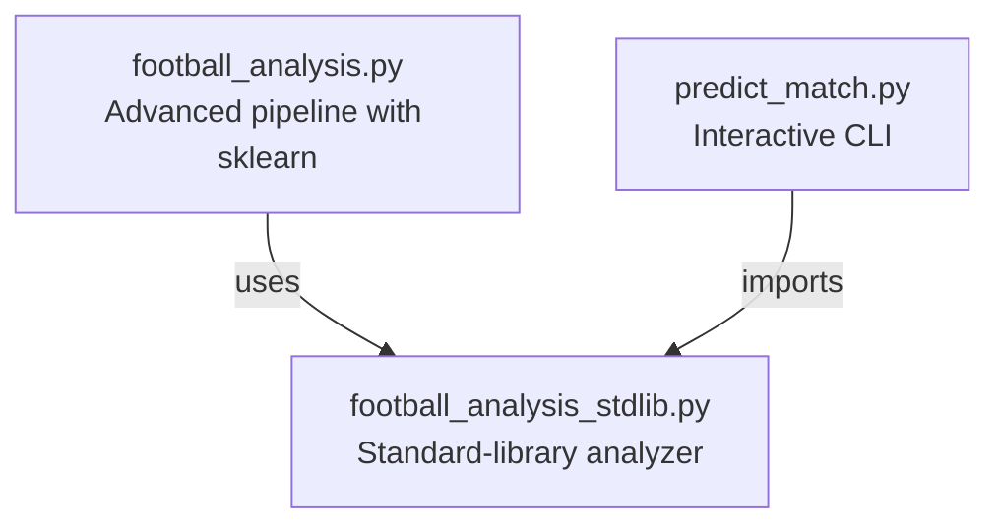
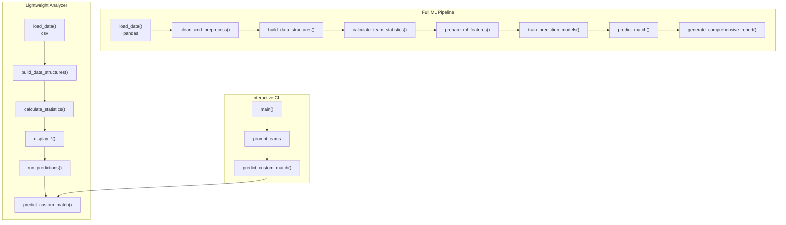
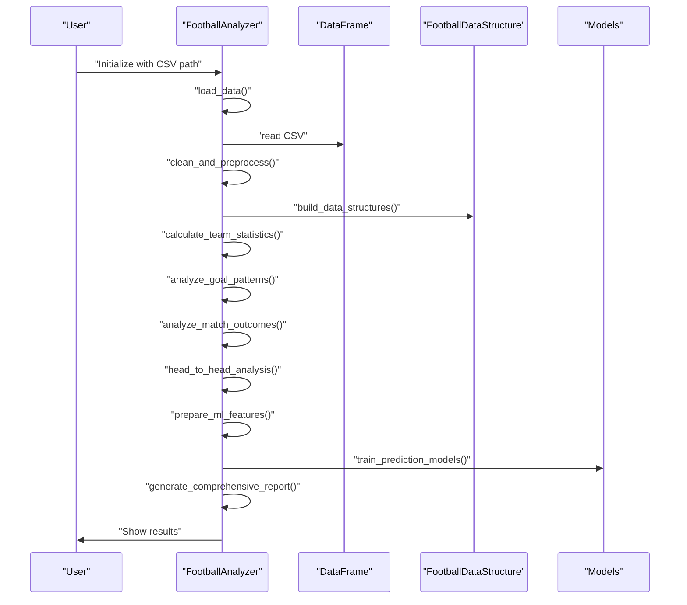
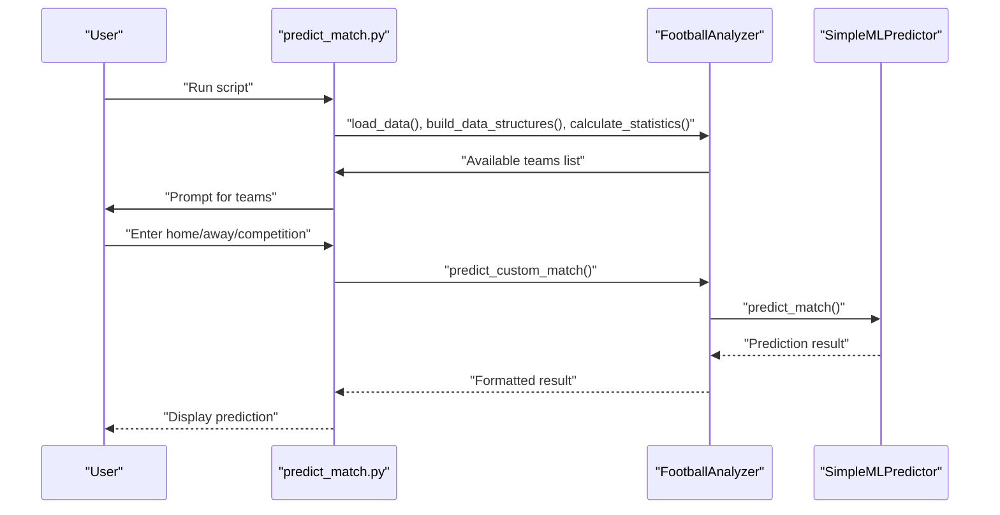
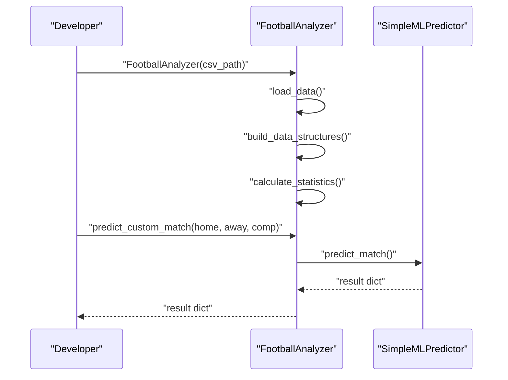
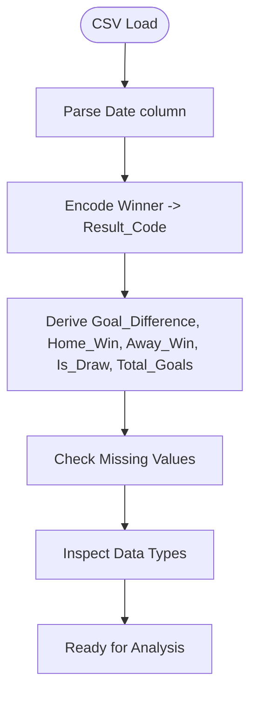
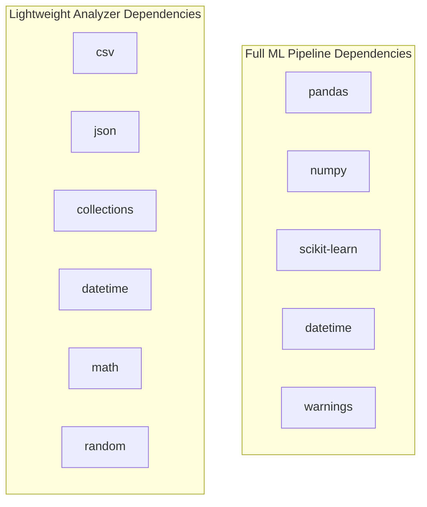

# Usage Examples

<cite>
**Referenced Files in This Document**
- [football_analysis.py](file://football_analysis.py)
- [football_analysis_stdlib.py](file://football_analysis_stdlib.py)
- [predict_match.py](file://predict_match.py)
</cite>

## Table of Contents
1. [Introduction](#introduction)
2. [Project Structure](#project-structure)
3. [Core Components](#core-components)
4. [Architecture Overview](#architecture-overview)
5. [Detailed Component Analysis](#detailed-component-analysis)
6. [Dependency Analysis](#dependency-analysis)
7. [Performance Considerations](#performance-considerations)
8. [Troubleshooting Guide](#troubleshooting-guide)
9. [Conclusion](#conclusion)
10. [Appendices](#appendices)

## Introduction
This document provides practical usage examples for the football match prediction system. It covers:
- Automated analysis workflows using the complete pipeline from data loading through model training and prediction generation
- Manual prediction processes using the interactive CLI interface with step-by-step team selection and prediction execution
- Custom analysis scenarios showing programmatic usage through Python API integration and direct class instantiation
- CSV data format requirements and preprocessing steps
- Examples of generating comprehensive reports, extracting team statistics, and interpreting prediction results
- Real-world scenarios such as pre-season analysis, mid-season predictions, and post-match analysis workflows
- Parameter tuning options, model selection strategies, and performance optimization techniques
- Troubleshooting guidance for typical implementation challenges

## Project Structure
The project consists of three primary modules:
- A scikit-learn-based pipeline with advanced preprocessing, feature engineering, and model training
- A lightweight standard-library-only analyzer with a simple ML predictor
- An interactive CLI for manual predictions

**Diagram sources**
- [football_analysis.py:1-673](file://football_analysis.py#L1-L673)
- [football_analysis_stdlib.py:1-547](file://football_analysis_stdlib.py#L1-L547)
- [predict_match.py:1-58](file://predict_match.py#L1-L58)

**Section sources**
- [football_analysis.py:1-673](file://football_analysis.py#L1-L673)
- [football_analysis_stdlib.py:1-547](file://football_analysis_stdlib.py#L1-L547)
- [predict_match.py:1-58](file://predict_match.py#L1-L58)

## Core Components
- Advanced analyzer with pandas/numpy/scikit-learn:
  - Loads CSV data, cleans/preprocesses, builds custom data structures, computes statistics, performs goal/outcome/head-to-head analysis, prepares ML features, trains models, predicts outcomes, and generates comprehensive reports
- Lightweight analyzer with standard library:
  - Loads CSV via CSV module, builds data structures, calculates statistics, displays team rankings, goal statistics, outcomes, head-to-head, competition stats, runs predictions, and supports custom predictions
- Interactive CLI:
  - Initializes analyzer, loads/builds data, displays available teams, and accepts user input to predict matches

Key capabilities:
- CSV data ingestion and preprocessing
- Team statistics computation and ranking
- Goal pattern and outcome analysis
- Head-to-head rivalry insights
- Competition-wise analysis
- Machine learning model training and selection
- Prediction with confidence and expected goals
- Comprehensive reporting

**Section sources**
- [football_analysis.py:84-673](file://football_analysis.py#L84-L673)
- [football_analysis_stdlib.py:183-547](file://football_analysis_stdlib.py#L183-L547)
- [predict_match.py:9-57](file://predict_match.py#L9-L57)

## Architecture Overview
The system supports two complementary architectures:
- Full ML pipeline (sklearn-based) for robust predictions and feature importance
- Lightweight standard-library analyzer for minimal dependencies and quick insights

**Diagram sources**
- [football_analysis.py:96-673](file://football_analysis.py#L96-L673)
- [football_analysis_stdlib.py:192-547](file://football_analysis_stdlib.py#L192-L547)
- [predict_match.py:9-57](file://predict_match.py#L9-L57)

## Detailed Component Analysis

### Automated Analysis Workflow (Full ML Pipeline)
End-to-end automated workflow using the sklearn-based analyzer:
- Load dataset from CSV
- Clean and preprocess data
- Build custom data structures
- Compute team statistics
- Analyze goal patterns and match outcomes
- Perform head-to-head analysis
- Prepare ML features and train models
- Generate comprehensive report
- Execute sample predictions

**Diagram sources**
- [football_analysis.py:96-673](file://football_analysis.py#L96-L673)

**Section sources**
- [football_analysis.py:96-142](file://football_analysis.py#L96-L142)
- [football_analysis.py:144-186](file://football_analysis.py#L144-L186)
- [football_analysis.py:189-235](file://football_analysis.py#L189-L235)
- [football_analysis.py:237-316](file://football_analysis.py#L237-L316)
- [football_analysis.py:318-347](file://football_analysis.py#L318-L347)
- [football_analysis.py:348-413](file://football_analysis.py#L348-L413)
- [football_analysis.py:415-477](file://football_analysis.py#L415-L477)
- [football_analysis.py:562-628](file://football_analysis.py#L562-L628)
- [football_analysis.py:630-668](file://football_analysis.py#L630-L668)

### Interactive CLI Usage (Manual Predictions)
Manual prediction process using the interactive CLI:
- Initialize analyzer and load/build data
- Display available teams
- Prompt for home team, away team, and competition
- Validate teams against known list
- Execute prediction and display results

**Diagram sources**
- [predict_match.py:9-57](file://predict_match.py#L9-L57)
- [football_analysis_stdlib.py:457-477](file://football_analysis_stdlib.py#L457-L477)

**Section sources**
- [predict_match.py:9-57](file://predict_match.py#L9-L57)
- [football_analysis_stdlib.py:457-477](file://football_analysis_stdlib.py#L457-L477)

### Programmatic Usage (Python API Integration)
Programmatic usage through direct class instantiation:
- Instantiate analyzer with CSV path
- Load and build data structures
- Calculate statistics
- Predict custom matches programmatically
- Access results and probabilities

**Diagram sources**
- [football_analysis_stdlib.py:183-547](file://football_analysis_stdlib.py#L183-L547)
- [football_analysis_stdlib.py:457-477](file://football_analysis_stdlib.py#L457-L477)

**Section sources**
- [football_analysis_stdlib.py:183-547](file://football_analysis_stdlib.py#L183-L547)
- [football_analysis_stdlib.py:457-477](file://football_analysis_stdlib.py#L457-L477)

### CSV Data Format Requirements and Preprocessing
Required CSV columns and preprocessing steps:
- Required columns: Date, Home Team, Away Team, Winner, Home Goals, Away Goals, Possession % (Home), Shots (Home), Corners (Home), Fouls (Home), Possession % (Away), Shots (Away), Corners (Away), Fouls (Away), Competition
- Preprocessing includes:
  - Parsing dates
  - Creating encoded outcomes and derived metrics (goal difference, total goals, binary outcomes)
  - Computing missing values and data types
  - Encoding categorical variables for ML features

**Diagram sources**
- [football_analysis.py:110-142](file://football_analysis.py#L110-L142)

**Section sources**
- [football_analysis.py:110-142](file://football_analysis.py#L110-L142)

### Generating Comprehensive Reports and Extracting Team Statistics
Comprehensive reporting includes:
- Dataset overview (matches, date range, teams, competitions)
- Team rankings by points
- Best attack and best defense
- Home vs away performance
- Competition analysis
- Model performance summary
- Prediction examples

Team statistics extraction:
- Matches played, wins, draws, losses, win/draw/loss rates
- Goals scored/conceded, goal difference, average goals scored/conceded
- Home/away win rates, average possession, shots, corners, fouls
- Points calculation

**Section sources**
- [football_analysis.py:562-628](file://football_analysis.py#L562-L628)
- [football_analysis.py:189-235](file://football_analysis.py#L189-L235)

### Interpreting Prediction Results
Prediction interpretation:
- Predicted winner (Home Team Win, Away Team Win, Draw)
- Confidence probabilities for each outcome
- Expected goals for home and away teams
- Optional feature importance for tree-based models

Model selection and tuning:
- Trains Random Forest, Gradient Boosting, and Logistic Regression
- Evaluates accuracy and selects the best model
- Provides feature importance for tree-based models

**Section sources**
- [football_analysis.py:415-477](file://football_analysis.py#L415-L477)
- [football_analysis.py:479-560](file://football_analysis.py#L479-L560)

### Real-World Scenarios
Pre-season analysis:
- Load historical data, compute team statistics, analyze goal patterns and outcomes
- Identify top teams, best attacks/defenses, and home/away trends
- Train models and generate baseline reports

Mid-season predictions:
- Use current season data to update team statistics
- Predict upcoming fixtures with confidence and expected goals
- Monitor performance and adjust expectations

Post-match analysis:
- Analyze match outcomes, goal patterns, and head-to-head results
- Compare predictions with actual results
- Generate reports summarizing performance and insights

[No sources needed since this section provides scenario guidance]

## Dependency Analysis
The system has two distinct dependency profiles:
- Full ML pipeline depends on pandas, numpy, scikit-learn, and standard libraries
- Lightweight analyzer depends only on standard libraries (csv, json, collections, datetime, math, random)

**Diagram sources**
- [football_analysis.py:6-18](file://football_analysis.py#L6-L18)
- [football_analysis_stdlib.py:6-11](file://football_analysis_stdlib.py#L6-L11)

**Section sources**
- [football_analysis.py:6-18](file://football_analysis.py#L6-L18)
- [football_analysis_stdlib.py:6-11](file://football_analysis_stdlib.py#L6-L11)

## Performance Considerations
- Data preprocessing:
  - Ensure CSV columns match expected names and types
  - Handle missing values appropriately before analysis
- Model training:
  - Use stratified splits for balanced evaluation
  - Scale features for linear models; keep raw features for tree-based models
  - Consider cross-validation for robust evaluation
- Prediction:
  - Encode categorical variables consistently during inference
  - Use expected goals derived from historical averages for interpretability
- Memory and speed:
  - For large datasets, consider chunked processing or sampling
  - Cache label encoders and scalers for repeated predictions

[No sources needed since this section provides general guidance]

## Troubleshooting Guide
Common issues and resolutions:
- CSV path errors:
  - Verify the CSV path exists and is accessible
  - Ensure the CSV contains all required columns
- Team name mismatches:
  - Use exact team names present in the dataset
  - Confirm team names are consistent across columns
- Model prediction failures:
  - Ensure categorical variables are encoded consistently
  - Check that label encoders and scalers are fitted during training
- Missing data:
  - Review missing values and data types after preprocessing
  - Impute or drop missing entries as appropriate
- Interactive CLI issues:
  - Enter 'quit' to exit interactive mode
  - Ensure team names are selected from the displayed list

**Section sources**
- [football_analysis.py:479-560](file://football_analysis.py#L479-L560)
- [predict_match.py:30-54](file://predict_match.py#L30-L54)

## Conclusion
The football match prediction system offers flexible usage patterns:
- Automated workflows for comprehensive analysis and predictions
- Interactive CLI for manual, guided predictions
- Programmatic API for integration and custom automation
By following the usage examples and troubleshooting guidance, users can effectively leverage the system for pre-season, mid-season, and post-match analysis, optimizing performance and interpreting results accurately.

[No sources needed since this section summarizes without analyzing specific files]

## Appendices

### Appendix A: End-to-End Automated Workflow Steps
- Initialize analyzer with CSV path
- Load and preprocess data
- Build data structures
- Compute team statistics
- Analyze goal patterns and outcomes
- Perform head-to-head and competition analysis
- Prepare ML features and train models
- Generate comprehensive report
- Execute sample predictions

**Section sources**
- [football_analysis.py:630-668](file://football_analysis.py#L630-L668)

### Appendix B: Interactive CLI Step-by-Step
- Run the CLI script
- View available teams
- Enter home team, away team, and competition
- Receive formatted prediction with probabilities and expected goals

**Section sources**
- [predict_match.py:9-57](file://predict_match.py#L9-L57)

### Appendix C: Programmatic API Usage
- Instantiate analyzer with CSV path
- Load and build data structures
- Calculate statistics
- Call predict_custom_match with desired teams and competition

**Section sources**
- [football_analysis_stdlib.py:528-542](file://football_analysis_stdlib.py#L528-L542)
- [football_analysis_stdlib.py:457-477](file://football_analysis_stdlib.py#L457-L477)